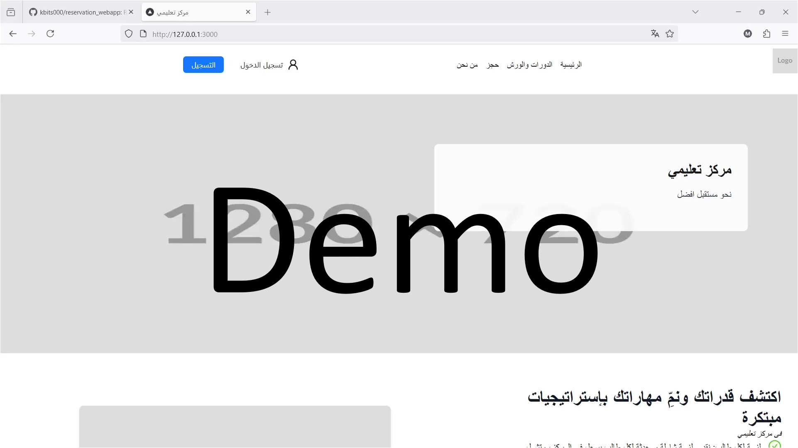

# Reservation Web App


## Overview
A full-stack web application built with [Next.js](https://nextjs.org) for reserving timeslots. Features Google OAuth authentication, role-based access control, and a comprehensive admin dashboard.


**Language:** Arabic (RTL support) | **Timezone:** Asia/Riyadh

[//]: # (Click on the image below to start the demo)

[//]: # ([![Demo]&#40;Demo_thumbnail2.png&#41;]&#40;https://private-user-images.githubusercontent.com/69712340/471145907-d7862412-73e2-41f3-9273-a014d4ec74c4.mp4?jwt=eyJhbGciOiJIUzI1NiIsInR5cCI6IkpXVCJ9.eyJpc3MiOiJnaXRodWIuY29tIiwiYXVkIjoicmF3LmdpdGh1YnVzZXJjb250ZW50LmNvbSIsImtleSI6ImtleTUiLCJleHAiOjE3NTM1NjIzMDYsIm5iZiI6MTc1MzU2MjAwNiwicGF0aCI6Ii82OTcxMjM0MC80NzExNDU5MDctZDc4NjI0MTItNzNlMi00MWYzLTkyNzMtYTAxNGQ0ZWM3NGM0Lm1wND9YLUFtei1BbGdvcml0aG09QVdTNC1ITUFDLVNIQTI1NiZYLUFtei1DcmVkZW50aWFsPUFLSUFWQ09EWUxTQTUzUFFLNFpBJTJGMjAyNTA3MjYlMkZ1cy1lYXN0LTElMkZzMyUyRmF3czRfcmVxdWVzdCZYLUFtei1EYXRlPTIwMjUwNzI2VDIwMzMyNlomWC1BbXotRXhwaXJlcz0zMDAmWC1BbXotU2lnbmF0dXJlPWZlODY0YWNjNTgxODM0ODRhMWU0ZGIxMjBlYzc5NGUyNGJiMWFhMzdhOGQ5MWJjMjgzMjE0NjU4N2I5Nzk4MDUmWC1BbXotU2lnbmVkSGVhZGVycz1ob3N0In0.hOaffvBW_vWQbln45iRC0FBowLOzSJP95_BWFVYLQ24&#41;)

## Demo

Click on the image below to watch the demo video:

[](https://private-user-images.githubusercontent.com/69712340/471145907-d7862412-73e2-41f3-9273-a014d4ec74c4.mp4?jwt=eyJhbGciOiJIUzI1NiIsInR5cCI6IkpXVCJ9.eyJpc3MiOiJnaXRodWIuY29tIiwiYXVkIjoicmF3LmdpdGh1YnVzZXJjb250ZW50LmNvbSIsImtleSI6ImtleTUiLCJleHAiOjE3NTM1NjIzMDYsIm5iZiI6MTc1MzU2MjAwNiwicGF0aCI6Ii82OTcxMjM0MC80NzExNDU5MDctZDc4NjI0MTItNzNlMi00MWYzLTkyNzMtYTAxNGQ0ZWM3NGM0Lm1wND9YLUFtei1BbGdvcml0aG09QVdTNC1ITUFDLVNIQTI1NiZYLUFtei1DcmVkZW50aWFsPUFLSUFWQ09EWUxTQTUzUFFLNFpBJTJGMjAyNTA3MjYlMkZ1cy1lYXN0LTElMkZzMyUyRmF3czRfcmVxdWVzdCZYLUFtei1EYXRlPTIwMjUwNzI2VDIwMzMyNlomWC1BbXotRXhwaXJlcz0zMDAmWC1BbXotU2lnbmF0dXJlPWZlODY0YWNjNTgxODM0ODRhMWU0ZGIxMjBlYzc5NGUyNGJiMWFhMzdhOGQ5MWJjMjgzMjE0NjU4N2I5Nzk4MDUmWC1BbXotU2lnbmVkSGVhZGVycz1ob3N0In0.hOaffvBW_vWQbln45iRC0FBowLOzSJP95_BWFVYLQ24)

## Features

### User Features
- **Google OAuth Authentication** - Secure sign-in with Google accounts
- **User Registration** - Register with name, email, phone number, and gender
- **Browse Reservations** - View available time slots on a calendar interface
- **Make Reservations** - Select date and time
- **User Dashboard** - View and manage personal reservations

### Admin Features
- **Reservation Management** - View, approve, or reject reservation requests
- **Calendar View** - Visual overview of all reservations
- **User Management** - View all registered users and their details
- **Block Dates/Times** - Mark specific dates or time periods as unavailable
- **Configure Settings** - Set operation hours, max reservations per user, advance booking days

### Technical Features
- **RTL Support** - Full Arabic language interface
- **Responsive Design** - Mobile-friendly with adaptive layouts
- **Role-Based Access Control** - Separate user and admin permissions

## Tech Stack

### Frontend
| Technology | Purpose |
|------------|---------|
| [Next.js](https://nextjs.org/) | React framework with App Router |
| [React](https://react.dev/) | UI library |
| [TypeScript](https://www.typescriptlang.org/) | Type-safe JavaScript |
| [TailwindCSS](https://tailwindcss.com/) | Utility-first CSS |
| [Ant Design](https://ant.design/) | UI component library |
| [Day.js](https://day.js.org/) | Date manipulation |

### Backend
| Technology | Purpose |
|------------|---------|
| [Next.js](https://nextjs.org/) | Server-side rendering & API routes |
| [Auth.js](https://authjs.dev/) | Authentication (Google OAuth) |
| [Zod](https://zod.dev/) | Schema validation |

### Database
| Technology | Purpose |
|------------|---------|
| [MongoDB](https://www.mongodb.com/) | NoSQL database |
| [Mongoose](https://mongoosejs.com/) | MongoDB ODM |

## Prerequisites

Before you begin, ensure you have met the following requirements:

- **[Node.js](https://nodejs.org/)** v18 or higher
- **[Git](https://git-scm.com/)** for version control
- **[MongoDB](https://www.mongodb.com/)** 6.x (local installation or MongoDB Atlas)
- **Google Cloud Console** project with OAuth 2.0 credentials

### Setting Up Google OAuth

1. Go to [Google Cloud Console](https://console.cloud.google.com/)
2. Create a new project or select an existing one
3. Navigate to **APIs & Services** > **Credentials**
4. Click **Create Credentials** > **OAuth 2.0 Client ID**
5. Configure the consent screen if prompted
6. Set application type to **Web application**
7. Add authorized redirect URI: `http://localhost:3000/api/auth/callback/google`
8. Copy the **Client ID** and **Client Secret**

## Installation
Follow these steps to set up the project on your local machine.

### 1. Clone the Repository
First, clone the repository from GitHub to your local machine using `git`:

```bash
git clone <repository-url>
cd reservation_webapp
```

### 2. Install dependencies
Install the dependencies required for the project:
```
npm i
```

### 3. Configure Environment Variables
Create an `.env` file to store the following variables:

```
# MongoDB Connection
MONGODB_URI="mongodb://127.0.0.1:27017/MONGODB_DATABASE_NAME" # MONGODB_DATABASE_NAME is your Mongodb database name.
AUTH_SECRET='YOUR_RANDOM_SECRET' # Added by `npx auth`. Read more: https://cli.authjs.dev The Secret should be HARD to guess.

# Google OAuth Credentials
AUTH_GOOGLE_ID='GOOGLE_OAUTH_CLIENT_ID'   # This is an OAuth 2.0 client id you get from Google. Read more: https://developers.google.com/identity/protocols/oauth2
AUTH_GOOGLE_SECRET='GOOGLE_OAUTH_CLIENT_SECRET' # This is an OAuth 2.0 client secret you get from Google. Read more: https://developers.google.com/identity/protocols/oauth2

# Auth.js Configuration
AUTH_TRUST_HOST=true
AUTHJS_SECRET_1='ANOTHER_RANDOM_SECRET_STRING' # This is a random string (i.e., secret) used to hash tokens, sign cookies and generate cryptographic keys. Read more: https://authjs.dev/reference/core#secret
AUTH_URL="http://localhost:3000"
```

### 4. Start the Development Server
To run the development server:

```bash
npm run dev
```
Open [http://localhost:3000](http://localhost:3000) with your browser.


## Usage

### User Flow

1. **Register**: Click "Register" and sign in with Google. Complete the registration form with your details.
2. **Browse**: Navigate to the reservation page to view available time slots.
3. **Book**: Select a date and time slot, provide a reason, and submit your reservation request.
4. **Wait for Approval**: Admin will review and approve/reject your request.

### Admin Flow

1. **Access Admin Panel**: Navigate to [http://localhost:3000/admin](http://localhost:3000/admin)
2. **View Reservations**: Use the calendar to see all reservations by date
3. **Manage Requests**: Review pending reservation requests
4. **Block Dates**: Mark specific dates or times as unavailable
5. **Configure Settings**: Set operation hours and booking limits

### Promoting a User to Admin

To grant admin privileges to a user:

1. Open your MongoDB client (MongoDB Compass or `mongosh`)
2. Connect to your database
3. Find the user document in the `users` collection
4. Update the `role` field from `"user"` to `"admin"`:


## Project Structure

```
src/
├── app/                          # Next.js App Router
│   ├── (admin)/admin/           # Admin dashboard pages
│   ├── (main)/                  # Public pages (home, reservation)
│   ├── (user)/                  # User dashboard
│   ├── (login)/                 # Login page
│   ├── (signup)/                # Registration page
│   └── api/                     # API routes
├── components/                   # React components
│   ├── header/                  # Navigation components
│   └── ui/                      # Page-specific components
├── lib/                         # Business logic
│   ├── _data_access/           # Database queries
│   ├── actions/                # Server actions
│   ├── database_models/        # Mongoose schemas
│   └── schemas/                # Zod validation
├── auth.ts                      # Auth.js configuration
├── auth.config.ts               # Auth providers
└── middleware.ts                # Route protection
```


## Learn More

To learn more about Next.js, take a look at the following resources:

- [Next.js Documentation](https://nextjs.org/docs) - learn about Next.js features and API.
- [Learn Next.js](https://nextjs.org/learn) - an interactive Next.js tutorial.


## Deployment

For production deployment, see the [Next.js deployment documentation](https://nextjs.org/docs/app/building-your-application/deploying).

**Important:** Before deploying to production:
1. Set `trustHost: true` and `useSecureCookies: true` in `src/auth.config.ts`
2. Use strong, unique values for `AUTH_SECRET` and `AUTHJS_SECRET_1`
3. Update `AUTH_URL` to your production domain

## Credits

- **[kbits000](https://github.com/kbits000)** - Project development and code implementation.